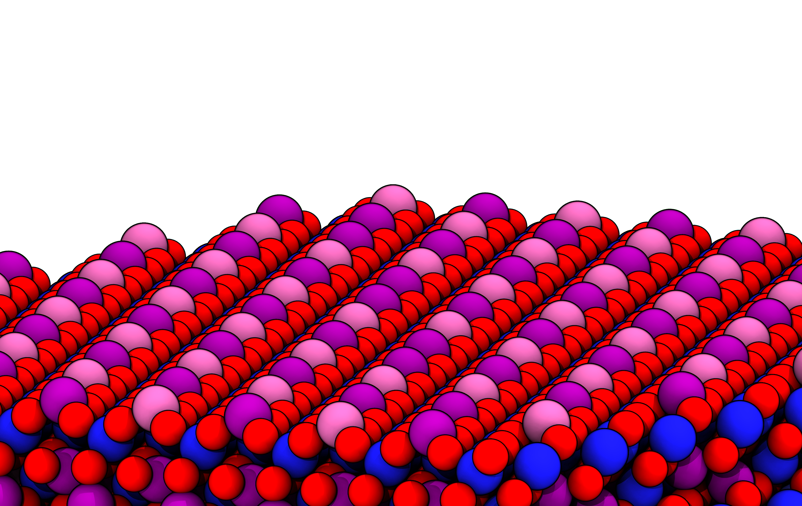

# Magnetite Slab

[](https://pubs.acs.org/doi/full/10.1021/acs.jpclett.3c01290)  

This repository contains scripts and data related to the slab section of [**Oxidation-State Dynamics and Emerging Patterns in Magnetite**](https://pubs.acs.org/doi/full/10.1021/acs.jpclett.3c01290)  

[](https://pubs.acs.org/doi/full/10.1021/acs.jpclett.3c01290) 

## Overview  
This repository provides computational workflows and analysis scripts used in the study of magnetite slabs through oxidation state swaps. The scripts support various tasks such as comparing different annealing schemes, oxidation state minimization of magnetite slabs, comparing linear and exponential annealing schemes, constrained oxidation state swaps, analyzing vacancy evolution in slabs, and modeling slabs with fixed bulk layers.

## Repository Structure  
```
magnetite_slab/
│
├── 220510_001_DBT_annealing_scheme_comparison/       # Comparison of different annealing schemes
│
├── 220815_001_111_DBT_001_SCV_comparison/            # Modeling different surface terminations
│   ├── 1_OO1_DBT/                                     
│   ├── 2_111_tet1/                                  
│   ├── 3_001_SCV/                                   
│   ├── 4_analysis/                                   # Data analysis scripts
│   ├── 5_benchmark_slurm/                            # Core usage scaling in SLURM
│
├── 220906_001_DBT_linear_exp_comparison/             # Annealing scheme comparison
│   ├── 1_linear/                                     # Linear temperature decay
│   ├── 2_exp/                                        # Exponential temperature decay
│   ├── 3_oct_constrained/                            # Constrained oxidation state swaps to Fe_oct
│   ├── 4_trimeron_analysis/                          # Trimeron fingerprint analysis
│   ├── 6_results/                                  
│
├── 221008_111_tet1_figure/                           # Visualization and figure generation
│
├── 230328_vacancy/                                   # Vacancy evolution in magnetite slabs
│   ├── 1_gen/                                        # Vacancy generation
│   ├── 2_eq/                                         
│   ├── 3_analysis/                                   # Vacany evolution analysis
│
├── 231214_surface_with_bulk/                         # Slabs with fixed bulk layers
│   ├── 1_surface21L_bulk22L/                         # Slabs with 21-layer surface and 22-layer bulk
│   ├── 2_surface13L-21L-29L_bulk24L/                 # Multiple surface/bulk configurations
│   ├── gen_slab/                                     # 001-DBT slab generation scripts
│ 
└── README.md                                         
```

## Related Publications  
If you use this repository, please cite the original paper:  
```bibtex
@article{Grsoy2023,
  title = {Oxidation-State Dynamics and Emerging Patterns in Magnetite},
  volume = {14},
  ISSN = {1948-7185},
  url = {http://dx.doi.org/10.1021/acs.jpclett.3c01290},
  DOI = {10.1021/acs.jpclett.3c01290},
  number = {30},
  journal = {The Journal of Physical Chemistry Letters},
  publisher = {American Chemical Society (ACS)},
  author = {G\"{u}rsoy,  Emre and Vonbun-Feldbauer,  Gregor B. and Meißner,  Robert H.},
  year = {2023},
  month = jul,
  pages = {6800–6807}
}
```
